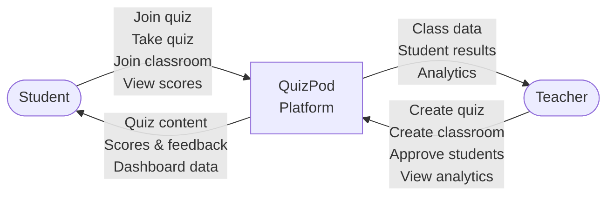
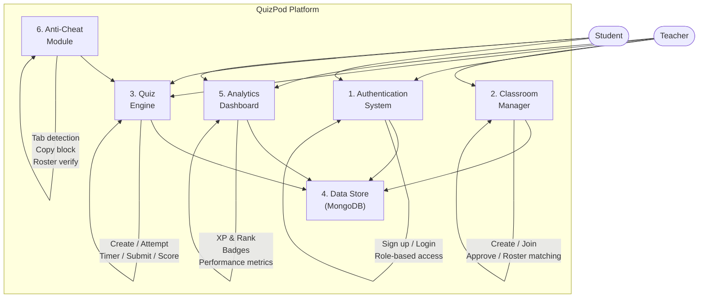

# QuizPod — Progress-1 Project Documentation

**Subject:** Web Technology  
**Project Title:** QuizPod — An Intelligent Quiz & Learning Platform  
**Team Size:** 6 members  
**Date:** March 2026  

---

## Table of Contents

1. [Topic of the Project](#1-topic-of-the-project)
2. [Structure of the Project with Technology Stack](#2-structure-of-the-project-with-technology-stack)
3. [Implementation](#3-implementation)
4. [Future Work and Teamwork](#4-future-work-and-teamwork)
5. [Additional Information](#5-additional-information)

---

## 1. Topic of the Project

### 1a. Problem Statement & Theme

**Problem:** Existing online quiz and learning platforms fail to genuinely optimize for *learning outcomes*. They prioritize engagement metrics (leaderboards, speed-based scoring) or administrative convenience (auto-grading, form-based assessments), while students are left with shallow feedback, no adaptive learning, and teachers receive minimal actionable analytics.

**Core Problem Areas:**
- **Shallow feedback** — Platforms show scores but never explain *why* an answer was wrong or *what to study next*.
- **No adaptive difficulty** — Every student gets the same quiz regardless of their skill level.
- **Academic integrity gaps** — Tab-switching, answer-sharing, and unauthorized access to quizzes are poorly addressed.
- **Unauthorized access** — Students not enrolled in a specific class can freely join if they obtain the access code, compromising quiz integrity.
- **Paywall exclusion** — Key features like analytics, student tracking, and rich question types are locked behind expensive paid tiers.
- **No collaborative learning** — Quizzes are always competitive; team-based learning modes are absent.

**Our Solution — QuizPod:** A web-based quiz platform that places learning outcomes at the center. It provides rich feedback, teacher-controlled classrooms with unauthorized-student detection, detailed performance analytics, and lightweight engagement elements like XP and badges — all for free.

**Value Proposition:**  
> *"The quiz platform that actually helps students learn, not just score — and actually helps teachers teach, not just grade."*

---

### 1b. Research on Existing Platforms

We conducted detailed research on 6 major quiz/assessment platforms to identify gaps and opportunities. A summary of findings is presented below:

#### Platforms Analyzed

| Platform | Primary Strength | Core Audience | Key Shortcoming |
|---|---|---|---|
| **Kahoot** | Gamified live quizzes | K-12, higher ed | Speed > accuracy; public leaderboard shaming; free tier capped at 10 players |
| **Quizlet** | Flashcards & study modes | Students (self-study) | Key modes behind paywall; ad-heavy free tier; no teacher analytics |
| **Google Forms** | Simple form-based quizzes | General/classroom | No native timer; no auto-save; easy mis-configuration exposes answers |
| **Mentimeter** | Real-time polling | Higher ed, corporate | Only 2 free interactive slides; weak analytics |
| **Socrative** | Formative live assessments | K-12 teachers | Capped at 50 students; significant price hikes; MCQ-only |
| **Typeform** | Conversational form UX | Business/HR | Expensive per-response pricing; no auto-close or resume |

#### Universal Gaps Across All Platforms

1. **No Adaptive Difficulty** — Questions never adjust based on student performance.
2. **Shallow Feedback** — Most platforms show a score with no explanation.
3. **No Spaced Repetition** — No intelligent review scheduling.
4. **Academic Integrity** — No lightweight anti-cheat mechanisms.
5. **Paywalls Block Core Features** — Analytics, tracking, and rich types are premium-only.
6. **No Collaborative Quizzing** — Students always compete, never cooperate.
7. **Poor Teacher Analytics** — Class averages but not per-concept diagnosis.
8. **Rich Content Limitations** — Code, LaTeX, diagrams not natively supported.
9. **Fragmented Workflow** — Quiz creation, sharing, grading are spread across tools.
10. **No Offline Mode** — All platforms require stable internet.

#### Research on Unauthorized Access Prevention

A specific area we investigated was *class access control*. Findings across major platforms:

| Platform | Access Mechanism | Gaps |
|---|---|---|
| **Google Classroom** | 6-8 character class code; domain restriction (admin-only) | Code can be shared/leaked; no teacher approval step |
| **Kahoot** | Temporary game PIN per session | No persistent "class" concept; anyone with PIN joins |
| **Quizizz** | Join code via joinmyquiz.com | Code-based, no approval; if you have the code, you're in |
| **Moodle** | Enrollment key, manual enrollment, cohort sync | Powerful but overly complex for teachers |
| **Canvas LMS** | SIS integration, self-enrollment codes | Institution-managed; teachers have limited control |
| **Edmodo** | Group code + teacher approval queue | ✅ Best approach — but Edmodo **shut down** in 2022 |

**Key Insight:** Most platforms rely on *"security by obscurity"* — a shared code is the only gate. Codes get leaked via WhatsApp/social media, there's no identity verification, and no teacher-approval step in popular quiz tools. Edmodo's approval-queue approach was the best but is no longer available. This creates a clear opportunity for QuizPod.

**Our approach combines:**
1. **Teacher approval queue** — students request to join, teachers approve/deny.
2. **Class roster matching** — students enter their roll number, matched against a pre-uploaded list.
3. **Auto-expiring join codes** — codes valid only for a limited time window.

*This combination does not exist in any current lightweight quiz platform.*

---

## 2. Structure of the Project with Technology Stack

### 2a. Project Structure — Pages & Sitemap

```
QuizPod Platform
│
├── Landing Page (/)
│   ├── Hero section with tagline & CTA buttons (Sign Up / Join Quiz)
│   ├── Feature cards (Practice Mode, Live Competitions, Track Progress)
│   └── Footer with social links
│
├── Authentication (/auth)
│   ├── Role selection toggle (Student / Teacher)
│   ├── Sign-up form (Name, Email, Password)
│   └── Animated binary-rain background
│
├── Student Dashboard (/student)
│   ├── Navbar (Home, XP counter, Join Quiz, Logout)
│   ├── Hero banner with stats (Rank, XP)
│   ├── Badge showcase
│   └── Recent Quizzes grid (title, score, date, category)
│
├── Teacher Dashboard (/teacher)
│   ├── Navbar (Home, Community, Create Quiz, Logout)
│   ├── Hero banner with stats (Total Quizzes, Upcoming Quizzes)
│   ├── Subject badges (Science, Math, English, Geography)
│   └── Recent Quizzes grid (title, subject, submissions count, date)
│
├── Quiz Arena (/quiz/:id)
│   ├── Navbar (brand, section name, theme toggle, countdown timer)
│   ├── Question panel (question text, MCQ radio options)
│   ├── Navigation (Previous, Mark for Review, Next/Submit)
│   ├── Status panel (question grid with color-coded status)
│   └── Built-in calculator tool
│
├── Create Quiz (/teacher/create-quiz)
│   └── Quiz builder for teachers — add questions, set options, assign to classroom
│
├── Create Classroom (/teacher/create-classroom)
│   └── Classroom creation — generate join codes, upload roster, manage enrollment
│
└── (Planned) Analytics, Mistake Book, AI-generated questions, etc.
```

### 2b. UI Design Principles & Topology

**Design Principles Applied:**

| Principle | Application in QuizPod |
|---|---|
| **Feedback-first, score-second** | Prioritize explaining wrong answers over raw scores |
| **No public shaming** | Private leaderboards; personal stats on dashboard |
| **Teacher time is precious** | Streamlined dashboard, at-a-glance stats |
| **Mobile-first approach** | Responsive CSS for all screen sizes |
| **Component-based architecture** | Each page is a self-contained React component with its own stylesheet |

**Design Topology:**
- **Component-based architecture** using React — modular, reusable UI components for consistency across the application.
- **Color-coded status system** in Quiz Arena: green for answered, yellow for marked-for-review, grey for not visited.
- **Role-based interface separation** — Student and Teacher dashboards are entirely different views with distinct layouts, stats, and actions tailored to each role.
- **Consistent visual language** — Shared design tokens (colors, spacing, typography) across all pages, with Tailwind CSS utility classes for rapid, consistent styling.

### 2c. Ideation & Brainstorming Process

**Team Discussion Process:**

1. **Problem Identification Phase:** Each team member individually used existing quiz platforms (Kahoot, Quizlet, Google Forms) and documented pain points encountered as students.

2. **Feature Brainstorming Sessions:** The team conducted multiple brainstorming sessions over **Google Meet** to discuss and prioritize features. During these sessions, we used collaborative design tools:
   - **Excalidraw** — Used for quick whiteboard-style sketching of page layouts, user flows, and architecture diagrams. Its freeform drawing allowed us to rapidly iterate on ideas during live calls.
   - **Figma** — Used for higher-fidelity wireframes and component design. We created mockups of key pages (Landing Page, Dashboards, Quiz Arena) to align the team on visual direction before coding.

   We consolidated all pain points and brainstormed feature solutions, categorized by priority:

   **High Priority Features:**
   - Student & Teacher Dashboards
   - Favorites list (Teacher)
   - Create Quiz functionality (Teacher)
   - Create Classroom (Teacher)
   - AI-generated questions targeting each student's weak topics
   - Anti-cheat: disable copy, screenshot, and tab-switch detection
   - Mechanism to detect unauthorized students

   **Low Priority Features:**
   - Question tags for categorization
   - Mistake book (personal error log)
   - Detailed student performance metrics
   - Coin/XP engagement mechanism

3. **Research Phase:** Formal research on 6 competing platforms to identify market gaps. Specific deep-dive on unauthorized access prevention across platforms.

4. **Architecture Design:** Settled on a client-server architecture with clear separation between student and teacher interfaces.

**Brainstorming Artifacts:**

> 📌 *[Placeholder: Insert Excalidraw sketches, Figma wireframes, and Google Meet session screenshots below]*

<!-- Add brainstorming images here -->
<!-- Example:  -->
<!-- Example:  -->
<!-- Example:  -->

---

### 2d. Technology Stack & Justification

| Layer | Technology | Version | Why This Choice? |
|---|---|---|---|
| **Frontend Framework** | React | 19.x | Component-based architecture perfect for a multi-page app with reusable UI elements (cards, badges, forms). Rich ecosystem and team familiarity. |
| **Build Tool** | Vite | 8.x | Extremely fast development server with Hot Module Replacement (HMR). Near-instant rebuild times vs. Webpack, improving developer productivity. |
| **Styling** | Tailwind CSS + Vanilla CSS | — | Tailwind provides utility-first classes for rapid, consistent styling with minimal custom CSS. Vanilla CSS is used alongside for complex component-specific styles where more control is needed. |
| **Backend Runtime** | Node.js | — | JavaScript across the full stack, reducing context-switching. Non-blocking I/O suited for real-time quiz features. |
| **Linting** | ESLint | 9.x | Catches bugs early, enforces consistent code style across 6 team members. |

### 2e. Deployment Plan

| Stage | Tool / Service | Details |
|---|---|---|
| **Version Control** | Git + GitHub | Repository at `DevAggarwal03/WebTech_Project` |
| **Frontend Hosting** | Vercel or Netlify | Free tier; automatic deployments from GitHub; global CDN |
| **Backend Hosting** | Render or Railway | Free tier; Node.js support; auto-deploy from GitHub |
| **Database** | MongoDB Atlas | Free tier (512 MB); cloud-hosted; native JavaScript driver |

### 2f. Data Flow Diagrams (DFD)

**Level 0 — Context Diagram:**



**Level 1 — Major Processes:**



---

## 3. Implementation

### 3a. Current Implementation Status (~50%)

The frontend of the application has been implemented with the following completed pages/components:

| # | Component | File | Status | Description |
|---|---|---|---|---|
| 1 | **Landing Page** | `QuizzLanding.jsx` | ✅ Complete | Hero section, feature cards (Practice Mode, Live Competitions, Track Progress), navbar, footer |
| 2 | **Authentication Page** | `AuthPage.jsx` | ✅ Complete | Role toggle (Student/Teacher), sign-up form with validation, animated binary-rain background effect |
| 3 | **Student Dashboard** | `StudentDashboard.jsx` | ✅ Complete | Welcome banner, XP & Rank display, badge showcase, recent quizzes grid |
| 4 | **Teacher Dashboard** | `TeacherDashboard.jsx` | ✅ Complete | Welcome banner, quiz stats (total/upcoming), subject badges, recent quizzes with submission counts |
| 5 | **Quiz Arena** | `QuizArena.jsx` | ✅ Complete | 20 sample questions, countdown timer (9:35), option selection, mark-for-review, question status grid, built-in calculator |
| 6 | **Feature Card** | `FeatureCard.jsx` | ✅ Complete | Reusable card component for landing page |
| 7 | **Backend Server** | `backend/index.js` | 🔲 Scaffold only | Node.js project initialized, implementation pending |

### 3b. Key Implementation Highlights

**1. Quiz Arena — Full Interactive Quiz-Taking Experience**

The Quiz Arena is the most feature-rich component — it is the dedicated area where students take their quizzes. It includes:
- **Countdown Timer:** Real-time countdown from 9:35, with urgent styling when under 60 seconds remaining.
- **Question Navigation:** Previous/Next buttons, question status grid for jumping to any question.
- **Mark for Review:** Students can flag questions they want to revisit, with visual star indicator.
- **Color-Coded Status Panel:**
  - 🟢 Green = Answered
  - 🟡 Yellow = Marked for Review
  - ⚪ Grey = Not Visited
- **Built-in Calculator:** A fully functional calculator tool for math-related quizzes, with basic arithmetic, clear, and backspace operations.

**2. Dual-Role Authentication**

The Auth page features:
- Student/Teacher role toggle — determines which dashboard the user sees after login.
- Animated binary rain background for visual appeal.
- Form validation with name, email, and password fields.

**3. Dashboard Personalization**

Both dashboards include:
- Personalized welcome messages
- Key stats at a glance (XP, Rank for students; Quiz count for teachers)
- Lightweight engagement elements: XP counter and achievement badges for students, subject badges for teachers
- Recent quiz activity with relevant metadata

**4. Component Architecture**

```
frontend/src/
├── components/
│   ├── AuthPage.jsx          (127 lines)
│   ├── FeatureCard.jsx       (reusable card)
│   ├── QuizArena.jsx         (221 lines — largest component)
│   ├── QuizzLanding.jsx      (88 lines)
│   ├── StudentDashboard.jsx  (106 lines)
│   └── TeacherDashboard.jsx  (118 lines)
├── styles/
│   ├── AuthPage.css          (4.8 KB)
│   ├── FeatureCard.css       (0.8 KB)
│   ├── LandingPage.css       (0.7 KB)
│   ├── QuizArena.css         (7.6 KB — most detailed)
│   ├── QuizzLanding.css      (3.1 KB)
│   ├── StudentDashboard.css  (7.2 KB)
│   └── TeacherDashboard.css  (7.8 KB)
├── App.jsx                   (main router)
├── main.jsx                  (React entry point)
├── index.css                 (global styles)
└── App.css                   (app-level overrides)
```

---

## 4. Future Work and Teamwork

### 4a. Remaining Work & Next Steps

| # | Task | Priority | Scope |
|---|---|---|---|
| 1 | **Backend API development** — Express.js REST API with user auth (JWT), quiz CRUD, classroom management | Critical | Backend |
| 2 | **Database integration** — MongoDB schemas for Users, Quizzes, Classrooms, Scores, Enrollments | Critical | Backend |
| 3 | **Unauthorized Student Detection** — Roster matching, teacher approval queue, auto-expiring join codes | High | Full Stack |
| 4 | **Anti-Cheat module** — Tab-switch detection, copy/paste blocking, screenshot prevention, quiz timer enforcement | High | Frontend |
| 5 | **AI-powered question generation** — Generate questions targeting each student's weak topics using AI APIs | High | Backend (API integration) |
| 6 | **Student performance metrics** — Detailed analytics, concept-wise performance tracking, strengths/weaknesses overview | Medium | Full Stack |
| 7 | **Question Tags** — Categorize questions by topic and difficulty level for filtering and targeted practice | Medium | Full Stack |
| 8 | **Mistake Book** — Personal error log for students to review wrong answers and track recurring mistakes | Medium | Full Stack |
| 9 | **Coin/XP Mechanism** — Lightweight engagement system with experience points earned from quiz participation and performance | Low | Full Stack |
| 10 | **Deployment** — Deploy frontend to Vercel/Netlify, backend to Render, database to MongoDB Atlas | Final | DevOps |

### 4b. Integration Components

| Component | Integration Details |
|---|---|
| **Authentication** | JWT-based auth connecting frontend AuthPage to backend API |
| **Quiz Data Pipeline** | Quiz creation → Database storage → Quiz Arena rendering → Score submission |
| **Classroom Enrollment** | Join-code generation → Student request → Teacher approval → Roster sync |
| **AI Question Generation** | Student performance data → AI API call → Personalized weak-topic questions → Review center |
| **Real-time Features** | WebSocket integration for live quiz sessions (potential) |

### 4c. Team Contribution

The team of 6 members is divided into two focused groups:

| Role | Members | Responsibilities |
|---|---|---|
| **Research + Documentation** | Dev, Mudit, Payal | Platform research, competitor analysis, feature specification, documentation, UI/UX design decisions, deployment planning |
| **Development** | Bhav, Ayush, Rohan | Frontend component development, CSS styling, backend API development, database schema design, integration |

> All members participate in ideation discussions, feature prioritization, and code reviews.

---

## 5. Additional Information

### 5a. Key Differentiators from Existing Platforms

| Feature | Kahoot | Quizlet | Google Forms | **QuizPod** |
|---|---|---|---|---|
| Teacher approval for enrollment | ❌ | ❌ | ❌ | ✅ |
| Roster-based access control | ❌ | ❌ | ❌ | ✅ |
| Auto-expiring join codes | ❌ | ❌ | ❌ | ✅ |
| In-quiz calculator | ❌ | ❌ | ❌ | ✅ |
| Role-based dashboards | ❌ | ❌ | ❌ | ✅ |
| XP & Badges | ✅ (speed-based) | ❌ | ❌ | ✅ (mastery-based) |
| Free tier limitations | 10 players | Paywalled modes | Basic only | **No paywall** |
| Anti-cheat (tab detection) | ❌ | ❌ | ❌ | ✅ (planned) |
| AI-generated weak-topic questions | ❌ | ❌ | ❌ | ✅ (planned) |
| Mistake book | ❌ | ❌ | ❌ | ✅ (planned) |

### 5b. Project Repository

- **GitHub:** `DevAggarwal03/WebTech_Project`
- **Structure:** Monorepo with `/frontend` (React + Vite) and `/backend` (Node.js)

### 5c. References

1. Kahoot — https://kahoot.com
2. Quizlet — https://quizlet.com
3. Google Forms — https://forms.google.com
4. Mentimeter — https://www.mentimeter.com
5. Socrative — https://www.socrative.com
6. Typeform — https://www.typeform.com
7. Google Classroom — https://classroom.google.com
8. Moodle LMS — https://moodle.org
9. Canvas LMS — https://www.instructure.com/canvas
10. Edmodo (discontinued 2022) — https://en.wikipedia.org/wiki/Edmodo
11. FlexiQuiz — https://www.flexiquiz.com
12. ClassMarker — https://www.classmarker.com
13. ProProfs Quiz Maker — https://www.proprofs.com/quiz-school

---

*Document prepared by the QuizPod team for Web Technology Progress-1 submission, March 2026.*
