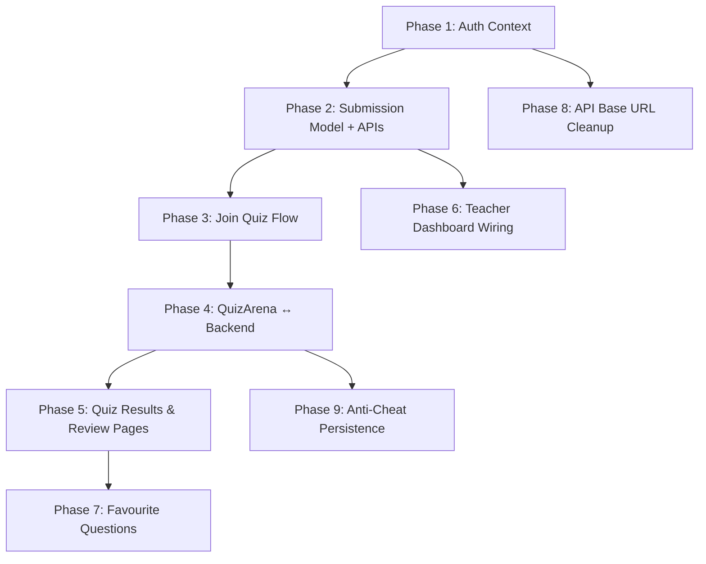

# QuizPod — Implementation Plan

> **Goal**: Wire the existing frontend UI to the real backend so the app is fully functional end-to-end.  
> Items marked 🟢 are quick wins; 🟡 are medium effort; 🔴 are large pieces.  
> Phases are ordered by dependency — each phase unblocks the next.

---

## Phase 1 — Auth Context & Dynamic User Data 🟢

> **Why first**: Every subsequent phase needs the logged-in user's name, ID, and role available globally, not hardcoded.

### 1.1 Create an `AuthContext` React context

| Detail | Value |
|---|---|
| **New file** | `frontend/src/context/AuthContext.jsx` |
| **Stores** | `token`, `user` (name, email, role, rollNo, _id) |
| **On mount** | Read `token` from `localStorage`, decode with a helper or keep the user object in `localStorage` too |
| **Provides** | `{ user, token, login(data), logout() }` |

### 1.2 Save full user object on login/register

**File**: `AuthPage.jsx`

Currently stores only `token` and `user_role`. Add:
```js
localStorage.setItem('user', JSON.stringify(response.data));
```

### 1.3 Consume context in dashboards

**Files**: `App.jsx`, `StudentDashboardV2.jsx`, `TeacherDashboard.jsx`, `QuizDetail.jsx`

- Remove hardcoded props (`studentName="Bhavya"`, `lastName="K."`, `teacherName="Sarah"`)
- Read from `AuthContext` instead
- Derive `streak` and `rank` from API later (static 0 for now is fine)

### 1.4 Logout everywhere

Replace the inline `localStorage.clear(); window.location.href = '/'` with `authContext.logout()` that clears storage and navigates to `/`.

---

## Phase 2 — Quiz Submission Model & Backend APIs 🟡

> **Why**: The DB currently has no way to record a student's attempt. This phase adds the data model and core CRUD routes.

### 2.1 Create `Submission` model

**New file**: `backend/models/Submission.js`

```js
const SubmissionSchema = new mongoose.Schema({
    quiz:       { type: ObjectId, ref: 'Quiz', required: true },
    student:    { type: ObjectId, ref: 'User', required: true },
    answers:    [{ questionIndex: Number, selectedOption: Number }],
    score:      { type: Number },           // computed on save
    totalCorrect: { type: Number },
    totalQuestions: { type: Number },
    warnings:   { type: Number, default: 0 }, // anti-cheat count
    submittedAt:{ type: Date, default: Date.now }
});
SubmissionSchema.index({ quiz: 1, student: 1 }, { unique: true }); // one attempt per student per quiz
```

### 2.2 New API routes

**Files**: `backend/controllers/quizController.js`, `backend/routes/quizRoutes.js`

| Method | Path | Auth | Description |
|---|---|---|---|
| `GET` | `/api/quiz/join/:code` | `protect` (student) | Look up quiz by `joinCode`, return quiz metadata (title, questionCount, timeLimit) — **no correct answers** |
| `GET` | `/api/quiz/:id/take` | `protect` (student) | Return full quiz questions **without `isCorrect`**. Used by QuizArena to load questions. |
| `POST` | `/api/quiz/:id/submit` | `protect` (student) | Accept `{ answers: [{questionIndex, selectedOption}], warnings }`, compute score server-side, create `Submission`, return `{ score, total, correctAnswers }` |
| `GET` | `/api/quiz/my` | `protect` (student) | Return all Submissions for this student (populated with quiz title, subject, date) |
| `GET` | `/api/quiz/:id/result` | `protect` (student) | Return one submission with full question data + correct answers (for post-quiz review) |
| `GET` | `/api/quiz/teacher/my` | `protect` + `requireTeacher` | Return all quizzes created by this teacher (for teacher dashboard) |
| `GET` | `/api/quiz/:id/submissions` | `protect` + `requireTeacher` | Return all submissions for a specific quiz (for teacher analytics) |

> [!IMPORTANT]
> The `/take` endpoint must **strip `isCorrect` from options** before responding, so students can't inspect the correct answers in the network tab.

---

## Phase 3 — Join Quiz Flow 🟡

> **Why**: Students need to enter a join code on `MyQuiz` → load the quiz → navigate to `QuizArena`.

### 3.1 Backend: `GET /api/quiz/join/:code`

- Find quiz by `joinCode`
- Check quiz `isPublished === true`
- Check student hasn't already submitted (no existing `Submission`)
- Return `{ _id, title, questionCount, timeLimit, subject, tags }`

### 3.2 Frontend: Wire `MyQuiz.jsx`

Currently `MyQuiz` tries several nonexistent candidate endpoints and falls back to mock data.

**Changes**:
- **Join form**: On submit, call `GET /api/quiz/join/${joinCode}` with auth header
- If successful, navigate to `/quizArena?quizId=${quiz._id}`
- **Previous quizzes list**: Call `GET /api/quiz/my`, render real data
- Remove `MOCK_QUIZZES` and all candidate-endpoint fallback logic
- Fix `API_BASE` from `5001` to `5000` (or make it configurable via `.env`)

> [!WARNING]  
> The frontend currently uses `http://localhost:5001` in some components and `http://localhost:5001` in others. Standardize to a single env variable: `VITE_API_BASE=http://localhost:5000` (matching backend's actual port).

---

## Phase 4 — QuizArena ↔ Real Backend 🔴

> **Why**: This is the core "take-a-quiz" flow. Currently uses `SAMPLE_QUESTIONS` and has no submission.

### 4.1 Load quiz questions from API

**File**: `QuizArena.jsx`

- Read `quizId` from URL search params (`useSearchParams` or `useParams`)
- On mount: `GET /api/quiz/${quizId}/take` → receive questions (text + options, no correct flags) and `timeLimit`
- Replace `SAMPLE_QUESTIONS` with API data
- Set `TOTAL_SECONDS` from the quiz's `timeLimit`
- Show a loading spinner until data arrives; show error if quiz not found

### 4.2 Submit answers to API

- On "Submit" click or auto-submit (timer/warnings), call `POST /api/quiz/${quizId}/submit`
- Send `{ answers, warnings: warningCount }`
- On success, navigate to `/student/quizdetail?quizId=${quizId}` to show results

### 4.3 Update App.jsx route

```jsx
<Route path="/quizArena" element={
  <ProtectedRoute requiredRole="student" element={<QuizArena />} />
} />
```
*(Already exists — just ensure QuizArena reads the quizId from the URL)*

---

## Phase 5 — Quiz Results & Review Pages 🟡

> **Why**: After submission, students need to see their actual score, not mock data.

### 5.1 Wire `QuizDetail.jsx`

- Remove `MOCK_QUIZ`
- Read `quizId` from URL params or search params
- On mount: `GET /api/quiz/${quizId}/result` → receive submission with questions, student's answers, correct answers, score
- Map API data into the existing component's rendering structure
- Favourites remain local-only for now (Phase 7)

### 5.2 Wire `MistakeBook.jsx`

- Remove `QUIZ_DATA` mock
- On mount: `GET /api/quiz/my` → get all submissions
- For each submission, filter questions where `selectedOption !== correctOption`
- Render using existing `MistakeCard` component

### 5.3 Wire `StudentPerformanceMetrics.jsx`

- Remove mock constants (`QUIZ_HISTORY`, `SUBJECT_ACCURACY`, `WEAK_TOPICS`)
- On mount: `GET /api/quiz/my` → compute stats from real submissions
- Derive: average score, best/worst quiz, accuracy by tag/subject, weak topics (tags with lowest accuracy)

### 5.4 Wire `StudentDashboardV2.jsx`

- Remove mock constants (`STATS`, `RECENT_QUIZZES`, `WEAK_TOPICS`, `WEEKLY`, `UPCOMING`)
- On mount: fetch `GET /api/quiz/my` for recent quizzes and compute stats
- "Upcoming quizzes" can remain empty or show a message for now (no scheduled-quiz concept exists yet)

---

## Phase 6 — Teacher Dashboard & Analytics 🟡

### 6.1 Wire `TeacherDashboard.jsx`

- Remove mock constants (`STATS`, `RECENT_QUIZZES`)
- On mount: `GET /api/quiz/teacher/my` → teacher's created quizzes
- Compute stats: quizzes created count, total unique students (from submissions), upcoming (quiz with no submissions yet)
- "Quick Actions" already navigate correctly — no changes needed

### 6.2 Teacher quiz detail / submissions view

**Optional new component or enhance existing**:

- From teacher dashboard, clicking a quiz → `GET /api/quiz/:id/submissions`
- Show list of students, their scores, and per-question breakdown
- Route: `/teacher/quiz/:quizId` (new route in `App.jsx`)

---

## Phase 7 — Favourite Questions Persistence 🟢

### 7.1 Add `favouriteQuestions` to User model

**File**: `backend/models/User.js`

```js
favouriteQuestions: [{
    text: String,
    options: [String],
    correct: Number,
    subject: String,
}]
```

### 7.2 New API routes

| Method | Path | Description |
|---|---|---|
| `POST` | `/api/user/favourites` | Add a question to favourites |
| `GET` | `/api/user/favourites` | Get all favourite questions |
| `DELETE` | `/api/user/favourites/:id` | Remove a favourite |

### 7.3 Wire `TeacherFavouriteQuestions.jsx`

- Replace `INITIAL_QUESTIONS` with API call to `GET /api/user/favourites`
- `saveQ()` → `POST /api/user/favourites`
- `deleteQ()` → `DELETE /api/user/favourites/:id`

### 7.4 Wire `QuizDetail.jsx` favourite button

- `toggleFav()` → call `POST /api/user/favourites` or `DELETE` depending on current state

---

## Phase 8 — API Base URL Cleanup 🟢

### 8.1 Standardize all API calls

**Files affected**: `AuthPage.jsx`, `CreateQuiz.jsx`, `MyQuiz.jsx` (and any new files)

- Create `frontend/src/config.js`:
  ```js
  export const API_BASE = import.meta.env.VITE_API_BASE || 'http://localhost:5000';
  ```
- Add `VITE_API_BASE=http://localhost:5000` to `frontend/.env`
- Replace all hardcoded `http://localhost:5001` / `http://localhost:5000` with `import { API_BASE } from '../config'`
- Verify backend runs on port `5000` (matches `backend/.env`)

---

## Phase 9 — Anti-Cheat Enhancements (Already Partially Done) 🟢

> **Current state**: `QuizArena` already implements fullscreen enforcement, tab-switch detection, copy/paste+screenshot blocking, warning system, and auto-submit on 3 violations. This is fairly complete.

### 9.1 Persist warning count to submission

- When submitting, include `warningCount` in the `POST /api/quiz/:id/submit` body
- Store in `Submission.warnings`
- Display in teacher's quiz submissions view

### 9.2 Optional enhancements (lower priority)

- CSS `print` media query to hide content on print (already done via `sec-protected` class)
- Disable DevTools via `debugger` traps (fragile, but optional)

---

## Excluded / Deferred Items

| Item | Reason |
|---|---|
| **PDF Roster Upload** | Complex (needs `pdf-parse` or `multer` + parsing). Can be added later as a teacher feature. |
| **Classroom model usage** | The `Classroom.js` model exists but no user flow depends on it. Skip for MVP. |
| **Coin / XP mechanism** | Explicitly deferred in `notes.txt`. |
| **Leaderboard** | Requires aggregation queries over submissions. Can be added after Phase 5. |

---

## Implementation Order Summary



> [!TIP]
> **Phase 8 (API URL cleanup)** can be done anytime alongside Phase 1 since it has no dependencies. Doing it early avoids debugging wrong-port issues.

---

## Files to Create (New)

| File | Purpose |
|---|---|
| `frontend/src/context/AuthContext.jsx` | Global auth state |
| `frontend/src/config.js` | API base URL constant |
| `backend/models/Submission.js` | Quiz attempt data model |

## Files to Modify (Heavy)

| File | Changes |
|---|---|
| `backend/controllers/quizController.js` | Add 5-6 new controller functions |
| `backend/routes/quizRoutes.js` | Add new routes |
| `frontend/src/components/QuizArena.jsx` | Replace mock data with API, add submit flow |
| `frontend/src/components/MyQuiz.jsx` | Wire join + quiz history |
| `frontend/src/components/QuizDetail.jsx` | Wire to real submission data |
| `frontend/src/components/MistakeBook.jsx` | Wire to real submission data |
| `frontend/src/components/StudentDashboardV2.jsx` | Wire stats to real data |
| `frontend/src/components/StudentPerformanceMetrics.jsx` | Wire stats to real data |
| `frontend/src/components/TeacherDashboard.jsx` | Wire stats to real data |
| `frontend/src/components/TeacherFavouriteQuestions.jsx` | Persist to backend |
| `frontend/src/components/AuthPage.jsx` | Store full user object |
| `frontend/src/App.jsx` | Remove hardcoded names, add new routes |
| `backend/models/User.js` | Add `favouriteQuestions` field |
